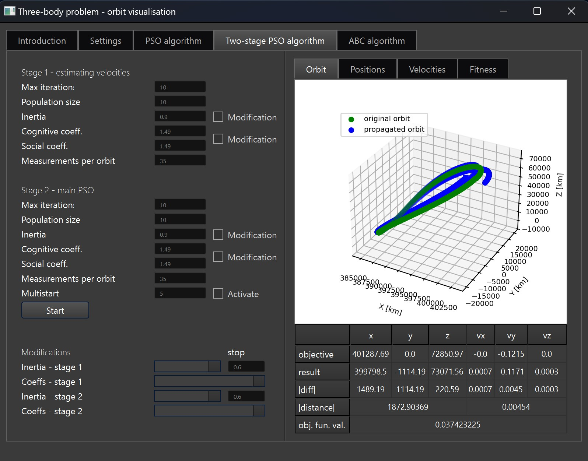

# Three-body-problem
Three-body problem Python simulation app, based on swarm optimization algorithms. 

> **Caution:** This project is still in development. More specific documentation will be added in the future. New functionalities are on their way as well!

# Table of Contents
- [Introduction](#introduction)
- [Requirements](#requirements)
- [Usage](#usage)
- [License](#license)

## Introduction
Initial Orbit Determination (IOD) is a process of establishing a body's orbit properties with a limited number of measurements in time. An object, like a satellite,
can be monitored and controlled based on the sparse observations of its state (positions and/or velocities). With just a few measurements and assumptions on the gravitational
forces, one can estimate the initial state and further propagate it in time to get complete information about the body's predicted movement.

There are many different approaches to the problem, and their usage depends on the available data. In my model, the expected orbits' positions and velocities in time are known,
as they come from [Three Body Periodic Orbits](https://ssd.jpl.nasa.gov/tools/periodic_orbits.html). In such a case, there is no need to include an additional measurement mechanism
or to change the units from metric to angular - states and velocities are given in [km] and [km/s] respectively. In a real-life scenario, it would be necessary to include the
additional radar or tracking satellite, to estimate the angles and measurement errors.

The gravitational forces can be included if assumptions on the bodies affecting the satellite are made. This simulation uses the Circular Restricted Three-Body Problem (CR3BP) 
movement equations. Both Moon and Earth determine the motion of the satellite. center of mass is the initial reference point.

This app uses three swarm optimization algorithms to find the initial states:
- Particle Swarm Optimization,
- Two-stage Particle Swarm Optimization (my own approach, using the original algorithm),
- Artificial Bee Colony Algorithm.
  
The choice was based on the model's and objective function's properties. This six-dimensional space is full of local minimums and reacts abruptly to even minor changes in the initial conditions.
The algorithms are expected to both explore the space and exploit the most promising initial states, to be able to determine the initial state and the initial orbit itself.

## Requirements
The requirements are gathered below. You can find them in 'requirements.txt'.
| Library/Tool        | Version   | Notes                                     |
|---------------------|-----------|-------------------------------------------|
| Python              | 3.11+     | Algorithms and GUI were created in Python |
| PyQt6               | 6.7.1     | GUI                                       |
| matplotlib          | 3.9.2     | Results visualisation                     |
| numpy               | 1.26.4    | Calculations                              |
| scipy               | 1.13.1    | Differential equations                    |
| pandas              | 2.2.2     | Loading and converting .csv data          |
| pytest              | 7.4.4     | Unit tests                                |
| pytest-cov          | 6.0.0     | Unit tests - coverage                     |
| pytest-mock         | 3.14.0    | Unit tests - mocking                      |
| pytest-qt           | 4.2.0     | Unit tests - PyQt elements                |

## Usage
Let's explore this project structure and ways to use it!
#### Structure
This project is built using the following, simplified structure:
```
Three-body-problem/
│── 📁 sources/                        # Algorithms - logic, useful data structures, and data processing
│   ├── 📄 abc_alg.py                    # Artificial Bee Colony implementation
│   ├── 📄 common_elements.py            # Structures, classes, etc. common for all the algorithms - scalable
│   ├── 📄 data_load.py                  # Orbit data preprocessing, unit converters
│   ├── 📄 data_structures.py            # Useful data structures to handle algorithms' inputs and outputs
│   ├── 📄 plot_functions.py             # Functions to handle plotting logic (data preparation, axis, legends, etc.) 
│   └── 📄 pso.py                        # Particle Swarm Optimization implementation - used by both basic and modified approaches
│── 📁 gui_files/                      # GUI - files used to define the GUI properties, handle translations and visualisation
│   ├── 📄 TBP_visualisation.py          # Python file with GUI generated by QtDesigner
│   ├── 📄 TBP_visualisation.ui          # .ui file with GUI generated by QtDesigner
│   ├── 📄 en_translation.qm             # Translations - English version definition (raw) 
│   ├── 📄 en_translation.es             # Translations - TypeScript - English version definition
│   ├── 📄🚀 gui.py                     --> #  [Run me!] Main GUI file, should be run to start the application
│   ├── 📄 user_inputs.py                # GUI file - input elements definitions
│   └── 📄 visualisation.py              # GUI file - visualisation elements - plots and tables
│── 📁 tests/                          # Unit tests
│   └── 📄 test_algorithms.py            # pytest file with unit tests for algorithms
│── 📁 orbits/                         # Text files with raw NASA orbits - processed by sources/data_load.py
│── 📁 LICENCES/                       # Licences for external sources used in this project
│── 📄 Combinear.qss                   # .qss template with pre-prepared GUI style 
└── 📄 requirements.txt                # .txt file with libraries required to run this project locally
```
#### Run me!
To run the project locally, all the [required libraries](#requirements) should be installed. The file structure should not be modified without further verification of dependencies, as many
imports are used in each directory. You can start GUI by running `gui.py`.
#### Next steps
When app starts, you will find 5 tabs you can interact with:
- **Introduction**: instructions and tips, original orbit selection,
- **Settings**: visualisation settings (to be extended),
- **PSO algorithm**: parameters selection and results visualisation,
- **Two-stage PSO algorithm**: parameters selection and results visualisation,
- **ABC algorithm**: parameters selection and results visualisation.

All algorithmic tabs share the same layout patterns:



You can set your preferred parameters in the control panel on the left. If your choice exceeds the limits, you will notice an error message, and the
field will turn red for a few seconds. The checkboxes neighbouring the parameters are used to activate the modifications (bottom-left) - additional parameters extending the basic functionalities. You will find more details in `docs/`.

You can run the algorithm by clicking on 'Start'. Depending on your parameters, it can take a few moments to generate the results. The set of plots includes:
- **Orbit**: comparison of original and propagated orbit,
- **Positions**: initial and final swarms limited to the first three dimensions,
- **Velocities**: initial and final swarms limited to the last three dimensions,
- **Fitness**: objective function values in each iteration.

You can compare the orbits using the score table. It contains the initial state of original and propagated orbit, the difference between them and final objective function value.

## License
This project in developed under MIT License. You can find the full clause [here](LICENSES/LICENSE.txt).

#### Third-Party Licenses
The project includes code and data from third-party sources:
- Combinear by DevSec Studio, licensed under MIT License. See [LICENSES/Combinear_license.txt](LICENSES/Combinear_license.txt) for details.
- JPL Three-Body Periodic Orbit Catalog data. See [Three Body Periodic Orbits](https://ssd.jpl.nasa.gov/tools/periodic_orbits.html) for details.

#### Credits
This project was inspired by [this article](https://arxiv.org/abs/2207.13175).

